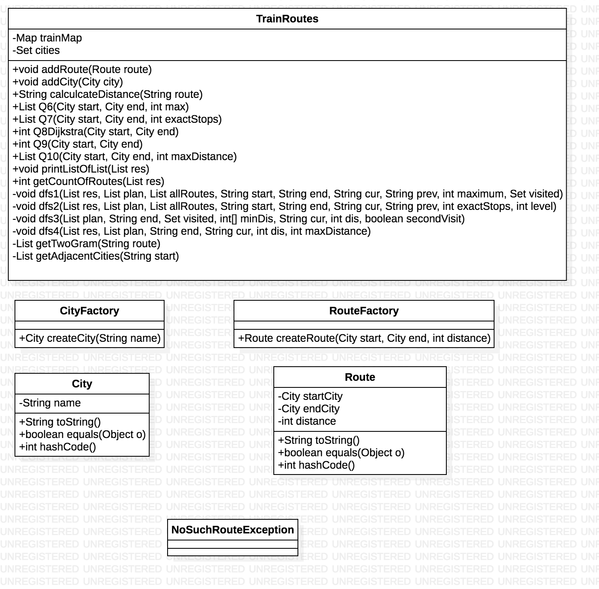

# TrainService

### The Structure of TrainService

#### Summary of the project

The TrainService System is constructed by 3 core objects which are TrainRoutes, City and Route. And the system also supplies two factories to create City and Route and a customized exception for handling some usecase. 

Considering that there can be multiple TrainRoutes objects in the possible future system, so I did not make it as a Singleton.

The reason I extract City and Route out from the TrainRoutes is simply decrease the coupling and this may be helpful for future extension on City and Route themselves even though the practical advantage did not reveal so far.

#### TrainRoutes Design Idea

* Fields:
  * Map<String, Integer> trainMap. The map is to record the Route in String format like "AE" and the reason the key is String it to simplify the calculation.
  * Set<City> cities is to record all the cities in the given graph
* APIs:
  * addRoute() and addCity() are to add new Route and new City to this TrainRoutes object.
  * calculateDistance(String rote) is to calculate the given route distance which is implemented for use case **Question1 - 5**. The route format will be checked at first. And also if any singe route which generated by getTwoGram(String route) did not exist in the map, the calculation cannot be complete as well.
  * Q6() and dfs1() are implemented for use case **Question6**, given start City, end City and maximum stops, show all the valid routes and its count.
  * Q7() and dfs2() are implemented for use case **Question7**, given start City, end City and exact stops, show all the valid routes and its count.
  * Q8Dijkstra() is implemented for use case **Question8**, given different two cities, return the shortest distance between them. If input two cities are exact one City, exception will be thrown and handled.
  * Q9() and dfs3() are implemented for use case **Question9**, given two identical City, return the shortest distance getting back to the same City. And this method can handle different cities input as well.
  * Q10() and dfs4() are implemented for use case **Question10**, given two cities and maximum distance, show all valid routes and its count.
  * printListOfList(List<List<String> res) and getCountOfRoutes(List<List<String>>) are two utility methods to print the result routes list and its count for use cases.
  * All the methods with City input or numeric input will check thier validation first. If input non-existed City or invalid number, IllegalArgumentException will be thrown and handled.

#### UML Diagram

### How to run

Please run the project under Java version 7 environment or higher.

After setting up the project in your local IDE or Java Runtime Environment, check out there is a Driver.java. And simply run the main method in this class in IDE or compile all the java files under the /src directory and run java Driver.java on your terminal.

In the Driver class, generateRoutes(), generateCities and constructTrainRoutes() are to initialize the TrainRoutes object. And the rest part of main() is for testing.

### About Testing

* For Q1-5, I designed 10 different test cases, valid or invalid, to check both the correctnes of the algorithm, the exception handling and the correctness of regular expression match.
* For Q6 - Q10: In Q6, I designed 4 test cases including two valid input and one non-existed city input and one invalid numeric input. For each method will handle this two kinds of exception first, so in other question test, I just skip this kind of exception test. And other questions tests are similar.
* About exception handling, at first I just throw the exception and the program will stop immediately. For the consistency of the test program in Driver, instead, I convert all the exceptions from throwing to handing in the method. So if there is any exception handled by the method, some message will be printed on the console, but you could possibly see some meaningless sentence printed, please just ignore them.

**IF YOU HAVE ANY QUESTIONS OR FIND ANY BUGS OR ERRORS, PLEASE CONTACT ME**

My E-mail: gyf940517@gmail.com